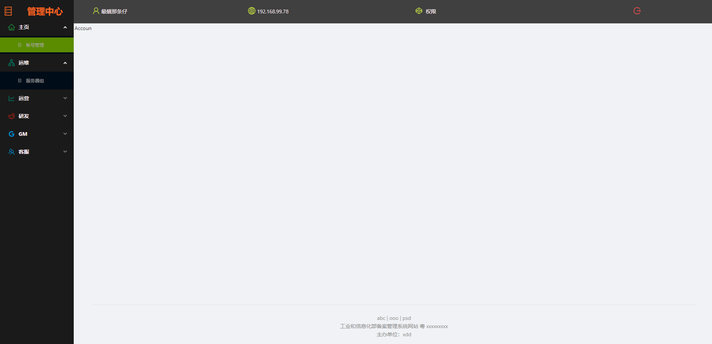

### 项目说明
- 自用项目，go自学，前端一般，欢迎大神交流指导，wx：119985829

### 后端
- go1.19.0 以上
```
 gin
 base64Captcha
 具体查看 server/go.mod
```

### 数据库处理
- server/init.sql
  - 分步处理添加超级管理员

### 开放端口
```shell
firewall-cmd --zone=public --add-port=10000/tcp --permanent
firewall-cmd --reload
```


### 修改
```shell
# 这里是后端配置
 cp server/bin/config/app.ini.bak server/bin/config/app.ini
```

###  前端主要依赖
```
  "antd": "^4.24.5",
  "react": "^18.2.0",
  "craco-less": "^2.1.0-alpha.0",
  // 具体查看 client/package.json
```


### 前端
- npm install
- .env
  - 打包目录|默认端口
- craco.config.js
  - 修改webpack配置

### 前端主要文件
- 入口
  - client/src/index.js
- 框架
  - client/src/frame
- routers|menu|friends|icp 配置
  - client/src/router/list.js

### 登录


### 内容

